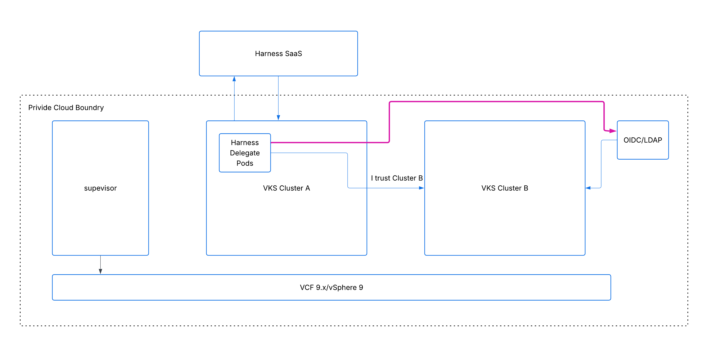
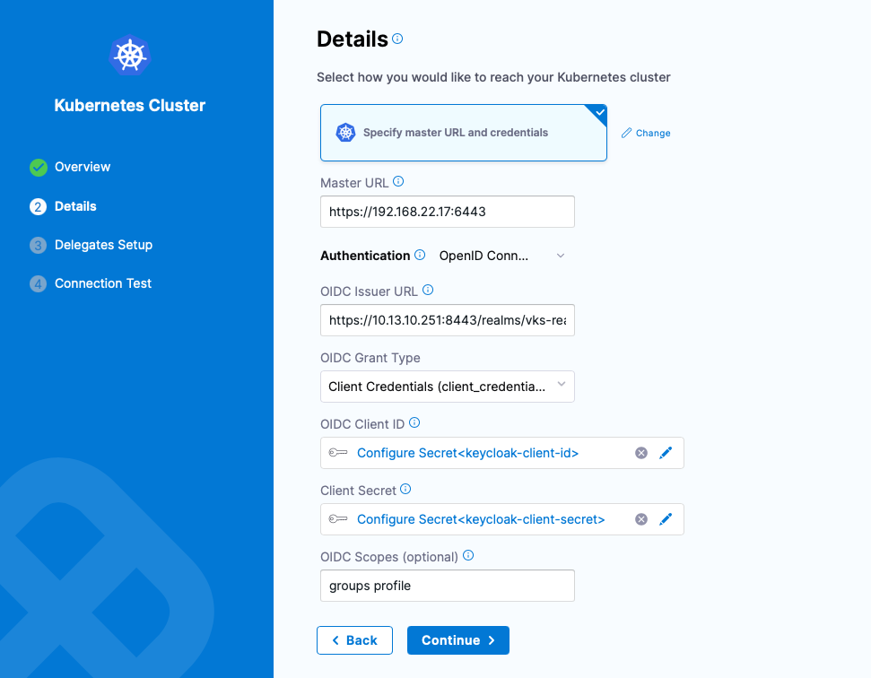

# Overview

This guide walks you through provisioning a VKS Kubernetes cluster utilizing a custom ClusterClass integrated with Keycloak for OpenID Connect (OIDC) authentication. This integration enables a Harness Kubernetes Connector to authenticate to the VKS cluster using Machine-to-Machine (M2M) access tokens, leveraging Harness Delegates running in Cluster A. Once Authenticated, Harness can deploy applications to OIDC integrated VKS cluster using CI/CD pipelines.

This OIDC integration adopts zero-trust principles by replacing static credentials with short-lived, dynamic tokens, which minimizes the attack surface and credential management overhead.


## High-Level Authentication Workflow
In this architecture, the Harness Delegate acts as the OIDC client. It requests an OIDC token from your Keycloak provider, which the VKS control plane trusts. Upon successful validation of this token, the VKS cluster grants the Harness Delegate the necessary permissions based on the RBAC roles bound to the authenticated user group.



## Prerequisites

* Active administrative access to the vSphere Supervisor Cluster.

* The VCF CLI and associated plugins installed and configured locally.

* Administrative access to your Keycloak instance (to retrieve realm parameters, client configurations, and CA certificates).

## Step-by-Step Deployment Guide

### Step 1: Create the Custom ClusterClass
Switch your command-line context to the vSphere Supervisor cluster and apply the custom ClusterClass in vmware-system-vks-public namespace. This cluster blueprint defines the baseline inline templates and executes the required JSON structural mutations to patch the API server flags.

```bash
# Authenticate and switch context to the Supervisor cluster
kubectl config use-context <SUPERVISOR-CONTEXT>

# Apply the custom ClusterClass definition
kubectl apply -f clusterclass-oidc.yaml
```

### Step 2: Deploy the Authentication Configuration Secret

Before instructing the topology engine to create the workload cluster, you must provision the Secret that holds the structured AuthenticationConfiguration.

> **Note:**  CRITICAL CONFIGURATION RULE: The Kubernetes OIDC schema mandates using the certificateAuthority field containing the raw, unencoded multi-line PEM text block. Do not use certificateAuthorityData or a base64-encoded string, as this will cause a strict schema decoding exception and crash the kube-apiserver static pod.

Apply the configuration secret inside your target namespace:

```bash
kubectl apply -f cluster-oidc-secret.yaml
```

### Step 3: Provision the Workload Cluster
Apply the core Cluster deployment manifest which references your newly created custom ClusterClass.

```bash
kubectl apply -f cluster-oidc.yaml
```

The Cluster API topology controller will process the manifests, match the validation tokens, and instruct vCenter to clone the node templates. 


### Step 4: Map RBAC Roles for Harness CICD Pipelines

Once the VKS workload cluster reaches the Running phase, the cluster administrator must fetch its administrative kubeconfig and bind the incoming Keycloak user groups to target roles within the workload cluster.

Run the following commands to extract the credentials and apply the clusterrolebinding.yaml policy directly onto the newly created VKS instance:

```bash
# Fetch the workload cluster's localized kubeconfig
kubectl get secret <cluster-name>-kubeconfig -n test-namespace -o jsonpath='{.data.value}' | base64 -d > workload.kubeconfig

# Bind the Keycloak groups to the cluster-admin role inside the workload cluster
kubectl --kubeconfig=workload.kubeconfig apply -f clusterrolebinding.yaml
```

This mapping validates the keycloak-group:default-roles-vks-realm token payload sent by the Harness Delegate (running in Cluster A), unblocking continuous application deployment tasks.

## Harness Kubernetes Connector Configuration


To configure this connector via the Harness UI, after selecting the right project, navigate to ***Project Settings > Connectors > Kubernetes Cluster > New Connector*** and use the following values:

* Name: test-cluster-connector
* Type: Speicify master URL and credentials
* Master URL: https://192.168.22.17:6443
* Authentication: Select OpenID Connect
* OIDC Issuer URL: https://10.13.10.251:8443/realms/vks-realm/protocol/openid-connect
* OIDC Grant Type: client_credentials
* OIDC Client ID Reference: keycloak-client-id
* OIDC Secret Reference: keycloak-client-secret
* OIDC Scopes: Add groups and profile
* Delegate Selectors: helm-delegate-irsa




> **Note:**  In this example, the helm-delegate-irsa delegate is running in Cluster A. You can obtain the Master URL (e.g., https://192.168.22.17:6443) from the workload.kubeconfig file generated in Step 4

Once the configuration is complete, the resulting YAML representation will appear as shown below.


```yaml
connector:
  name: test-cluster-connector
  identifier: testclusterconnector
  description: ""
  accountIdentifier: axs4qKS3SYmPeIACSysCuA
  orgIdentifier: default
  projectIdentifier: mymodernapp
  type: K8sCluster
  spec:
    credential:
      type: ManualConfig
      spec:
        masterUrl: https://192.168.22.17:6443
        auth:
          type: OpenIdConnect
          spec:
            oidcIssuerUrl: https://10.13.10.251:8443/realms/vks-realm/protocol/openid-connect
            oidcGrantType: client_credentials
            oidcClientIdRef: keycloak-client-id
            oidcSecretRef: keycloak-client-secret
            oidcScopes: groups profile
    delegateSelectors:
      - helm-delegate-irsa
    ignoreTestConnection: false

```

### Sample Deployment Pipeline

To validate that your OIDC-enabled Kubernetes connector is functioning correctly, you can use the sample deployment pipeline below. This pipeline utilizes a standard Kubernetes Rolling Deployment strategy, which provides a safe and reliable way to test service rollouts. Additionally, the pipeline is configured with a failure strategy that automatically triggers a stage rollback in the event of errors, ensuring cluster stability during testing.


```yaml
pipeline:
  name: deployment-pipeline
  identifier: deploymentpipeline
  projectIdentifier: mymodernapp
  orgIdentifier: default
  tags: {}
  stages:
    - stage:
        name: Deploy
        identifier: Deploy
        description: ""
        type: Deployment
        spec:
          deploymentType: Kubernetes
          service:
            serviceRef: appdeployservice
          environment:
            environmentRef: prodenv
            deployToAll: false
            infrastructureDefinitions:
              - identifier: oidcintegratedenv
          execution:
            steps:
              - step:
                  name: Rollout Deployment
                  identifier: rolloutDeployment
                  type: K8sRollingDeploy
                  timeout: 10m
                  spec:
                    skipDryRun: false
                    pruningEnabled: false
            rollbackSteps:
              - step:
                  name: Rollback Rollout Deployment
                  identifier: rollbackRolloutDeployment
                  type: K8sRollingRollback
                  timeout: 10m
                  spec:
                    pruningEnabled: false
        tags: {}
        failureStrategies:
          - onFailure:
              errors:
                - AllErrors
              action:
                type: StageRollback
```


## References
- [Custom ClusterClass Example: External OIDC Authentication](https://techdocs.broadcom.com/us/en/vmware-cis/vcf/vcf-service-administration-and-development/9-0/managing-vsphere-kuberenetes-service-clusters-and-workloads/provisioning-tkg-service-clusters/using-the-cluster-v1beta1-api/using-the-versioned-clusterclass/example.html#GUID-36bb3bf7-32fb-45ab-889e-c5eb42715b73-en)